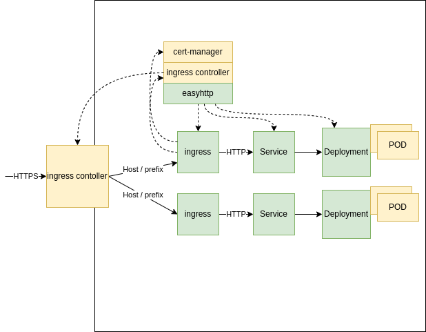

# easyhttp

Kuberneres Operator. The main purpose of this operator to easy deploy HTTP application your kubernetes cluster. 
Currently this is my best operator, since it is my first one :) 

## Description
The operator exposes the HTTP port and setup all necessary resources in the cluster. The owner of the created
resource is the EasyHttp oprator.

Main features:
- Creates deployment, service and ingress resource in cluster
- Setup host based virtual hosting in ingress [host-based hosting](https://kubernetes.io/docs/concepts/services-networking/ingress/#name-based-virtual-hosting)
- Support specification chages
- Environment variables in application container can be setup

Managed resources (green):



## Limitation
The rewrite possibility is missing from ingress. One host per application can be deployed.

## Prerequirements

### ingress

By default ingress is not installed in k8s. In order to setup proper host based routing ingress controlled should be existed in cluster.

[See ingress here](https://kubernetes.io/docs/concepts/services-networking/ingress/)

Check if ingress and issuers are exsisted:

Check Custom resources:
```
$ kubectl get crd | grep -i issue
clusterissuers.cert-manager.io        2023-03-26T12:01:58Z
issuers.cert-manager.io               2023-03-26T12:01:58Z
```
The EasyHttp uses namespace scoped issuers so 'issuers.cert-manager.io' should be installed

issuer:
```
$ kubectl get issuers -n test
NAME                  READY   AGE
letsencrypt-staging   True    57m
letsencrypt-prod      True    50m
```

The created issuer name should be set in operator kind specification (certManIssuer: "letsencrypt-staging", see later)

Installing ingress see the proper kubernetes implementation details.

When using [kind](https://github.com/kubernetes-sigs/kind) see ingress [here](https://kind.sigs.k8s.io/docs/user/ingress/)

install nginx ingress in kind cluster: 
```
kubectl apply -f https://raw.githubusercontent.com/kubernetes/ingress-nginx/main/deploy/static/provider/kind/deploy.yaml
```


### certificate manager

Install certificate manager (https://cert-manager.io/) if you want auto certificate manager.

See:
* https://cert-manager.io/docs/tutorials/acme/nginx-ingress/
* https://cert-manager.io/docs/configuration/acme/http01/

The installation provides HTTP01 challenge 

See: 
*  https://cert-manager.io/docs/configuration/acme/http01/
*  https://letsencrypt.org/docs/challenge-types/


How to install? See: https://cert-manager.io/docs/installation/

install in nutshell:
1) intall cert-manager
```
kubectl apply -f https://github.com/cert-manager/cert-manager/releases/download/v1.11.0/cert-manager.yaml
```

2) create issuer(s)

The samples below shows how to create acme letsencrypt issuer in namespace 'test'. As the operator is namescpase scoped the issuer should create the namesapace where the application is running. One of these should use in kind sepcification (certManIssuer).

```
kubectl create --edit -f https://raw.githubusercontent.com/cert-manager/website/master/content/docs/tutorials/acme/example/production-issuer.yaml -n test


kubectl create --edit -f https://raw.githubusercontent.com/cert-manager/website/master/content/docs/tutorials/acme/example/staging-issuer.yaml  -n test
```


## Using the operator


### sample EasyHttp yml config 

```
apiVersion: httpapi.github.com/v1
kind: EasyHttp
metadata:
  name: kuard-1
  labels:
    app.kubernetes.io/name: easyhttp
    app.kubernetes.io/instance: easyhttp-sample
    app.kubernetes.io/part-of: easyhttp
    app.kubernetes.io/managed-by: kustomize
    app.kubernetes.io/created-by: easyhttp
spec:
  host: "example.net"
  replicas: 1
  image: "gcr.io/kuar-demo/kuard-amd64"
  tag: "1"
  port: 8080
  env:
    PORT: "8080"
  certManIssuer: "letsencrypt-staging"

```
### Description
- *host*: The HTTP request to this host will be routed to application
- *replicas*: Deployment replicas
- *image*: Application docker image
- *tag*: image tag
- *port*: the HTTP port wher the application is listening
- *env*: Environment variable passed to the pod
- *certManIssuer*: used certificate issuer

## Installing operator on cluster

The operator can be installed using pre-defined kubernetes configuration. The operator will be installed into 'easyhttp-system' namespace.

The following example install v0.1 of EasyHttp operator (CRD and controller)
```
kubectl apply -f https://raw.githubusercontent.com/akosbalogh005/easyhttp-operator/0.1/config/easyhttp-operator_crd.yml
kubectl apply -f https://raw.githubusercontent.com/akosbalogh005/easyhttp-operator/0.1/config/easyhttp-operator_controller.yml
```

The git repo is [here](https://github.com/akosbalogh005/easyhttp-operator/). 
The package is stored in [ghcr.io](https://github.com/akosbalogh005/easyhttp-operator/pkgs/container/easyhttp) repository.


TODO: helm chart repository for easy installation and management


## Develping - Getting Started
You’ll need a Kubernetes cluster to run against. You can use [KIND](https://sigs.k8s.io/kind) to get a local cluster for testing, or run against a remote cluster.
**Note:** Your controller will automatically use the current context in your kubeconfig file (i.e. whatever cluster `kubectl cluster-info` shows).

### Running on the cluster
1. Install Instances of Custom Resources:

```sh
kubectl apply -f config/samples/dep_kuard.yml
```

2. Build and push your image to the location specified by `IMG`:

```sh
make docker-build docker-push IMG=<some-registry>/easyhttp:tag
```

3. Deploy the controller to the cluster with the image specified by `IMG`:

```sh
make deploy IMG=<some-registry>/easyhttp:tag
```

### Uninstall CRDs
To delete the CRDs from the cluster:

```sh
make uninstall
```

### Undeploy controller
UnDeploy the controller from the cluster:

```sh
make undeploy
```

### How it works
This project aims to follow the Kubernetes [Operator pattern](https://kubernetes.io/docs/concepts/extend-kubernetes/operator/).

It uses [Controllers](https://kubernetes.io/docs/concepts/architecture/controller/),
which provide a reconcile function responsible for synchronizing resources until the desired state is reached on the cluster.

### Test It Out
1. Install the CRDs into the cluster:

```sh
make install
```

2. Run your controller (this will run in the foreground, so switch to a new terminal if you want to leave it running):

```sh
make run
```

**NOTE:** You can also run this in one step by running: `make install run`

### Modifying the API definitions
If you are editing the API definitions, generate the manifests such as CRs or CRDs using:

```sh
make manifests
```

**NOTE:** Run `make --help` for more information on all potential `make` targets

More information can be found via the [Kubebuilder Documentation](https://book.kubebuilder.io/introduction.html)

## License

Copyright 2023.

Licensed under the Apache License, Version 2.0 (the "License");
you may not use this file except in compliance with the License.
You may obtain a copy of the License at

    http://www.apache.org/licenses/LICENSE-2.0

Unless required by applicable law or agreed to in writing, software
distributed under the License is distributed on an "AS IS" BASIS,
WITHOUT WARRANTIES OR CONDITIONS OF ANY KIND, either express or implied.
See the License for the specific language governing permissions and
limitations under the License.

## TODOs in the future

The following features / ideas will be implemented in the next version:
- Adding multiple path to one host and (rewrite functionality) 
- Implement proper unittests
- Implement acceptance tests
- Releases:
  - create helm chart for operator after tagging


